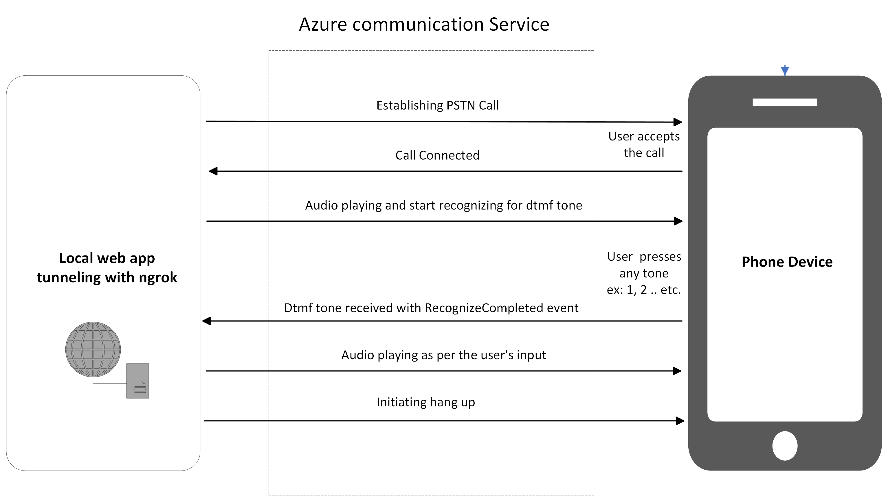

# Recognize Dtmf Call Sample

This sample application shows how the Azure Communication Services Server Calling SDK can be used to build IVR related solutions. This sample makes an outbound call to a phone number or a communication identifier and plays an audio message. application plays audio according to whatever tone 1 (tone1), 2 (tone2) and 3 (tone3), presses by callee.
If the callee presses any other key then an audio of invalid tone got played and the application ends the call. This sample application is also capable of making multiple concurrent outbound calls.
The application is a console based application built on .Net Framework 4.7.2.

# Design

## Prerequisites

- Create an Azure account with an active subscription. For details, see [Create an account for free](https://azure.microsoft.com/free/)
- [Visual Studio (2019 and above)](https://visualstudio.microsoft.com/vs/)
- [.NET Framework 4.7.2](https://dotnet.microsoft.com/download/dotnet-framework/net472) (Make sure to install version that corresponds with your visual studio instance, 32 vs 64 bit)
- Create an Azure Communication Services resource. For details, see [Create an Azure Communication Resource](https://docs.microsoft.com/azure/communication-services/quickstarts/create-communication-resource). You'll need to record your resource **connection string** for this sample.
- Get a phone number for your new Azure Communication Services resource. For details, see [Get a phone number](https://docs.microsoft.com/azure/communication-services/quickstarts/telephony-sms/get-phone-number?pivots=platform-azp)
- Download and install [Ngrok](https://www.ngrok.com/download). As the sample is run locally, Ngrok will enable the receiving of all the events.
- (Optional) Create Azure Speech resource for generating custom message to be played by application. Follow [here](https://docs.microsoft.com/azure/cognitive-services/speech-service/overview#try-the-speech-service-for-free) to create the resource.

> Note: the samples make use of the Microsoft Cognitive Services Speech SDK. By downloading the Microsoft Cognitive Services Speech SDK, you acknowledge its license, see [Speech SDK license agreement](https://aka.ms/csspeech/license201809).

## Before running the sample for the first time

1. Open an instance of PowerShell, Windows Terminal, Command Prompt or equivalent and navigate to the directory that you'd like to clone the sample to.
2. git clone https://github.com/Azure-Samples/Communication-Services-dotnet-quickstarts.git.

### Configuring application

- Open the app.config file to configure the following settings

	- Connection String: Azure Communication Service resource's connection string.
	- Source Phone: Phone number associated with the Azure Communication Service resource.
	- DestinationIdentities: Multiple sets of phonenumber targets. These sets are seperated by a semi-colon.

    	Format: "OutboundTarget1(PhoneNumber); OutboundTarget2(PhoneNumber);OutboundTarget3(PhoneNumber)".

	  	For e.g. "+1425XXXAAAA; +1425XXXBBBB; +1425XXXCCCC"

	- NgrokExePath: Folder path where ngrok.exe is insalled/saved.
	- SecretPlaceholder: Secret/Password that would be part of callback and will be use to validate incoming requests.
	- CognitiveServiceKey: (Optional) Cognitive service key used for generating custom message
	- CognitiveServiceRegion: (Optional) Region associated with cognitive service
	- CustomMessage: (Optional) Text for the custom message to be converted to speech.
	- SalesCustomMessage: (Optional) Text for the custom message when callee presses 1.
	- MarketingCustomMessage: (Optional) Text for the custom message when callee presses 2.
	- CustomerCustomMessage: (Optional) Text for the custom message when callee presses 3.
	- InvalidCustomMessage: (Optional) Text for the custom message when callee presses invalid tone.
